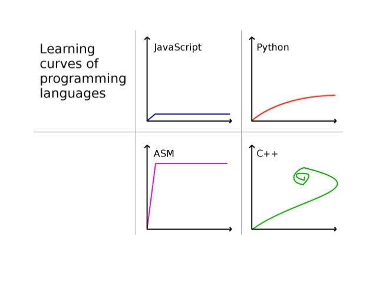

**Zastanawiasz się nad karierą programisty? Myślisz czego trzeba się nauczyć i jakie są wymagania na stanowisko juniorskie? Chcesz uczyć się skutecznie i osiągnąć dobre rezultaty w niedługim czasie? Jesteś w dobrym miejscu!**

## Poradnik nauki programowania

Nazywam się Łukasz Ziobroń i oddaję w Twoje ręce ten oto poradnik nauki programowania. Nauczam programowania od ponad 5 lat. Od ponad 8 lat programuję zawodowo, a jeśli doliczymy do tego projekty hobbystyczne to będzie już… 18 lat. Jestem założycielem Coders School i autorem programów nauczania, które stosuję w przekazywaniu wiedzy o języku C++. W swoim życiu przeszkoliłem już ponad 700 osób, trochę udzielałem się we wrocławskich społecznościach związanych z językiem C++. Skuteczne przekazywanie wiedzy jest moją pasją i nieustannie kształcę się w tym chcąc jeszcze skuteczniej uczyć programowania.

Stworzyłem ten poradnik, aby pomóc Ci w skutecznym uczeniu się C++ lub też dowolnego języka programowania. Jego lektura nie jest ograniczona tylko dla potencjalnych programistów C++. Przeczytać go może każdy, kto chce zostać programistą, a fragmenty dotyczące samego C++ może pominąć. Ten poradnik ma na celu podpowiedzenie Ci, czego i w jaki sposób się uczyć, jeśli chcesz w przyszłości pracować jako programista C++. Będzie on zawsze otwarty i darmowy. Zamierzam go w przyszłości aktualizować, wraz z tym, jak będzie się zmieniał język C++ oraz programistyczny rynek. Myślę, że 60 minut powinno Ci wystarczyć na dokładne przeczytanie całego tego artykułu. Poradnik nauki programowania opisuje tajniki branży programistycznej i trochę demaskuje niektóre związane z nią mity. Mówi o tym, jak można wejść do tej branży i się nie zajechać. Porównuje bootcampy z innymi formami nauczania. Zaczynamy!

## Chcę programować

### Prehistoria

Dawniej programowanie było wiedzą tajemną. Jeśli ktoś chciał się go nauczyć, to trzeba było mieć jakieś materiały. Podkreślę słowo jakieś, bo jakiekolwiek materiały były trudno dostępne. Toteż większość programistów wywodziła się z uczelni. Uczelnie zawsze wiodły prym w liczbie źródeł i jakości przekazywanej wiedzy. Odkąd upowszechnił się internet czasy zaczęły się zmieniać. Obecnie mamy raczej zalew materiałów na każdy właściwie temat, także na temat programowania. Podobno od przybytku głowa nie boli, ale jednak strasznie trudno znaleźć coś, co nam podpasuje i dzięki czemu zmotywowani usiądziemy do nauki i szybko zauważymy pierwsze efekty. 

Jeśli jesteś programistą pomyśl jak kiedyś wyglądało programowanie bez StackOverflow, gdzie w ciągu kilku sekund znajdujesz odpowiedź na Twoje pytanie. Ja jeszcze pamiętam te czasy, gdy w liceum zabrałem się za pisanie własnego silnika CMS na moją stronę o StarCrafcie – [Starcraft Area][1]. Strona stoi do dziś, ale z racji tego, że nie znałem dobrych praktyk to kod tego silnika jest wydajny jak maluch na gaz. Przejrzystość kodu jest z kolei podobna do przejrzystości wody w Gangesie.

Dużo ludzi wyznaje zasadę *Done is better than perfect*. Ja również zaliczam się do tych ludzi, przez co troszkę walczę ze swoim perfekcjonizmem, ale do słynnego motto dodaję jeszcze coś od siebie. *Screwed up is worse than done*. Pełna wersja po polsku to *Zrobione jest lepsze od doskonałego. Spierniczone jest gorsze od zrobionego*. W związku z tym jeśli mam coś zrobić, a będzie to słabe, to nawet się za to nie zabieram.

### Umowa z programistą, czyli jak wygląda rekrutacja w branży IT?

Uczyć się każdy potrafi. Wystarczą przecież studia i już można programować. Albo jakiś bootcamp. W szczególności jeśli już pracuje się poza branżą IT, ale ma się pieniądze. Stąd też prosta droga do zbijania kokosów. Czy aby na pewno? Dzisiejszy rynek pracy bardzo szybko weryfikuje te założenia. Okazuje się, że odpowiedzi zazwyczaj brzmią nie i nie. Zatem o co chodzi z tym tytułowym uczeniem się C++ albo nawet ogólniej z uczeniem się programowania?

Niewątpliwie obecnie jest moda na programowanie. Ba, nawet nie moda, ale przymus. Kursy programowania typu bootcamp rosną jak przysłowiowe grzyby po deszczu, a pracodawcy sami organizują własne akademie i kursiki dla osób, które chciałyby zostać programistami. Zatem wygląda na to, że faktycznie niedobór pracowników jest ogromny. Chodzą plotki, że nawet siłą zmusza się ludzi do podpisywania kontraktów albo robione są łapanki na ulicy i złapani są od razu wcielani do korporacji — obejrzyj [ten](2) film 🙂 W dzisiejszych czasach, gdy socjal jest łatwo dostępny, programiści żyją jak pączki w maśle, a nikomu nie chce się pracować, trzeba się uciekać do naprawdę podłych sztuczek.

https://www.youtube.com/watch?v=oyuH4Nm_md0 (2)

Każdy na pewno ma kolegę programistę, który już po roku zarabiał [wykopowe 15k](3). A programiści to ogólnie przychodzą do pracy tylko wypić kawę, posiedzieć przed Facebookiem i „piniąszki” się zgadzają. Więc o co tutaj chodzi? Dlaczego Ci ludzie z łapanek tak bardzo nie chcą mieć takiego fajnego życia?

Poczytaj co ludzie piszą na wykopie odnośnie programowania. [Tutaj](4) Mirek żali się, że po bootcampie nie ma pracy, a [tutaj](5) inny dziwi się ile zarabiają programiści.

O tym, jaka jest prawda na pewno wiedzą sami programiści, ale to też nie wszyscy. Dopiero tacy programiści, którzy są już na rynku przez parę lat i zmieniali sami pracę (często kilkukrotnie), wiedzą jak to wygląda. Osoby spoza branży, które chciałyby wejść do tego programistycznego raju, tylko się dziwią. Jak tak można? Gdzie te braki, gdzie te łapanki? Dlaczego mi się to w ogóle nie udaje, chociaż na studiach było dużo programowania?

### Każdy może NIE być programistą, czyli daruj sobie ten pomysł

Gdy zadasz pytanie *Czy każdy może zostać programistą?* w dowolnej szkole programowania to pewnie w większości powiedzą, że każdy, ale niektórym będzie potrzeba więcej czasu, a innym mniej. Zasadniczo jest to prawda, ale ja mam trochę bardziej radykalne poglądy w tej kwestii. Według mnie nie każdy nadaje się na programistę. W niektórych przypadkach po prostu nie warto zaczynać, bo to będzie „orka na ugorze”, jak to mawiał mój nauczyciel matematyki z liceum, którego chciałem serdecznie pozdrowić. Nie warto marnować czasu swojego i trenera, jeśli nie masz ku temu predyspozycji. Napiszę nawet więcej. Nie chodzi tylko o predyspozycje.

W swojej karierze nauczyłem programowania już wiele osób. Na moich kursach weryfikuję, kto do mnie przychodzi i na jakim jest poziomie. Nigdy nie zaczynam kursów z poziomu zero. Po naukę podstaw odsyłam do darmowych materiałów z internetu. Dopiero jak ktoś może się pochwalić jakąś aplikacją, to możemy porozmawiać o dalszym kształceniu. Współpracując z różnymi osobami, mogę podać jedną cechę, która jest cechą odróżniającą osoby, którym uda się skutecznie przejść przez kurs od tych, którym się to nie uda. Ta cecha to… motywacja. Tak. Taka wewnętrzna. Jeśli ktoś po prostu chce programować, bo to lubi, to będzie poświęcał na to czas. Jeśli natomiast ktoś jest zmotywowany w inny sposób, np. poprzez pieniądze, bo programiści dużo zarabiają, to doskonale wiem, że takie osoby, nawet jeśli uda im się przejść przez kurs to ciężko będzie im znaleźć pracę.

Jeśli jakaś szkoła, czy kurs mówią Ci, że po tym pieniądze posypią się z nieba, to po prostu Cię okłamują. To czy pieniądze będą, czy nie, nie zależy od kursu, ale od Ciebie. Oczywiście, dobrze zaprojektowany i przygotowany kurs łatwiej przeprowadzi Cię przez tę drogę, ale jeśli masz motywację i słaby kurs czy też słabe materiały to rezultat będzie lepszy niż zapisanie się na niesamowicie dobry kurs, ale bez Twojej wewnętrznej motywacji, bez pasji. W skrócie — jeśli lubisz programowanie to super. Jeśli nie lubisz — nawet nie zaczynaj. To niczego w Twoim życiu nie zmieni. Jeśli nie wiesz, bo nigdy tego nie robiłeś/-aś — zacznij od darmowych kursów z internetu i się przekonaj.

### C++ najlepszy, czyli nie pytaj o polecenie języka na start

Programowanie programowaniu nierówne. Język językowi nierówny. Na początku wiele osób staje przed wyborem języka programowania. Wybierają długo, szukają, radzą się znajomych programistów, zasypują fora i grupy internetowe pytaniami. A prawda jest taka, że każdy programista będzie głównie polecał język, w którym sam pisze.

Dlaczego więc C++ jest najlepszy? ( ͡° ͜ʖ ͡°)

Odpowiedź: bo jest jednym z najtrudniejszych języków programowania. Zacząć jest dość łatwo, ale poziom mistrzowski osiąga się bardzo długo. Często też w ogóle się go nie osiąga, bo znając C++ znacznie łatwiej przerzucić się na inne języki programowania, w szczególności na C# lub Javę. Programistyczny rynek jest bardzo otwarty na takich inżynierów oprogramowania, którzy mają C++ w swoim doświadczeniu. Dlatego mistrzów C++ nie ma wielu.

Według użytkowników serwisu [Jaxenter C++](6) znajduje się na podium, jeśli chodzi o języki najtrudniejsze do nauczenia się, co prezentuje poniższy wykres, zaczerpnięty z tego serwisu.

Polecam też zajrzeć pod [to](7) repozytorium na GitHubie, gdzie porównane jest uczenie się różnych języków programowania. Obrazek z C++ zamieszczam też poniżej.

Chociaż według mnie najbardziej trafna krzywa uczenia się C++ wygląda tak:

Krzywą tą zaprezentował mój kolega Sławek na jeden ze spotkań wrocławskiej grupy C++. [Tutaj](8) link do jego prezentacji o boost::python.

Język C++ jest stosunkowo mało popularny jeśli chodzi o wybór kursów czy bootcampów w tym języku. Ale w sumie to jest plus. Mniej kursów, więc mniejsza konkurencja, więc łatwiej się wbić w branże. I tak i nie. Trzeba jednak przyswoić dużo wiedzy, a to już jest wyzwanie dla wytrwałych. Pisząc w C++ będziesz się ścierać z problemami, których nie ma w innych językach programowania. Jeśli nie zniechęca Cię to, to czytaj dalej 🙂

### Nowoczesny C++

W nauce C++ najgorszy jest fakt, że w internecie znajdziesz mnóstwo, naprawdę mnóstwo i jeszcze raz podkreślę — mnóstwo przestarzałych materiałów i informacji na temat C++. Jeśli widzisz jakieś artykuły, pytania, czy cokolwiek związanego z C++ koniecznie musisz sprawdzić datę tej publikacji. Często okazuje się, że jest wiele mitów, które powielane są z pokolenia na pokolenie (takiego programistycznego pokolenia, czyli gdy różnica wieku to jakieś 3-5 lat ;)), tylko dlatego, że artykuł jest stary lub ktoś nie zna aktualnego C++. Od roku 2011 C++ zmienił się bardzo. I zmienia się ciągle. Właściwie to każdy język programowania się zmienia, ale C++ miał wyraźne zahamowanie w latach 2003-2011, kiedy to oficjalnie nic się z tym językiem nie działo (działo się, ale bardziej za kulisami). Inne języki poszły wtedy bardzo do przodu, a C++ jaki był, każdy widział. I niestety bardzo odbiło się to na poziomie jego nauczania. Nauczyciele akademiccy poznali tego C++, a tak naprawdę uczyli **C z klasami**,  a nie C++ i niestety uczą go nadal. Ja nazywam to językiem C+ (czyt. ce plus).

### IDE w roli generatora ciągów losowych znaków, czyli dlaczego vim jest dobry?

## Nauka programowania

### Naucz się C++ w 21 dni

### Czy można uczyć się szybciej?

### IT arystokracja, czyli znajomy programista

### Odwrócona klasa, czyli mój kurs stacjonarny

### Praca grupowa

## Kursy programowania online

### Ścieżki ninja, czyli kurs C++ online w Coders School

### Platforma do kursu online

### Ten NPC daje dużo golda i XP za questa ze smokiem, czyli kiedy nauka wygląda jak gra

## Skrzynka z narzędziami, czyli moje metody uczenia

### Moja metodologia

#### Pre-work

#### Pre-test

#### Post-test

#### Post-work

#### Punktowanie zamiast oceniania

### Świetna atmosfera

## Co jest wymagane na junior developera C++?

### Obowiązkowo

### Mile widziane (poziom mida)

### Niepotrzebne (poziom seniora)

## Minusy bootcampów

### Intensywność i harmonogram

### Podstawy programowania

## Pytania od publiczności

### Szkoła programowania w CV

### Upragniony certyfikat, czyli co zrobić, gdy zabraknie papieru toaletowego?

### Brakujące doświadczenie

### Czy po kursie online mogę uzyskać certyfikat?

### Nie od zera? Jak to?

### Pomorze ktoś? Niestety, Mazowsze.

## Podsumowanie

### Pakiet promocyjny dla wytrwałych

 [1]: [http://scarea.pl]
 [2]: [https://www.youtube.com/watch?v=oyuH4Nm_md0]
 [3]: [https://www.wykop.pl/tag/programista15k/]
 [4]: [https://www.wykop.pl/wpis/46132657/anonimowemirkowyznania-skonczylem-bootcamp-i-zosta/]
 [5]: [https://www.wykop.pl/wpis/46130795/dlaczego-programisci-az-tyle-zarabiaja-ostatnio-si/]
 [6]: [https://jaxenter.com/most-difficult-programming-languages-152590.html]
 [7]: [https://github.com/Dobiasd/articles/blob/master/programming_language_learning_curves.md]
 [8]: [https://www.slideshare.net/szborows/boostpython-domesticating-the-snake]