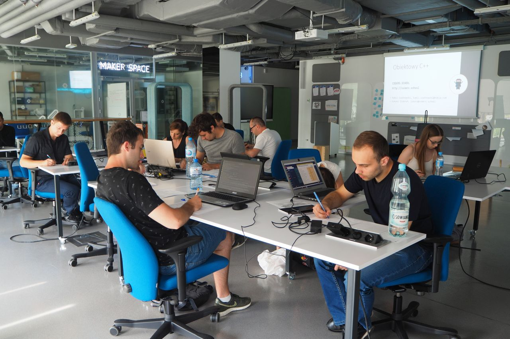
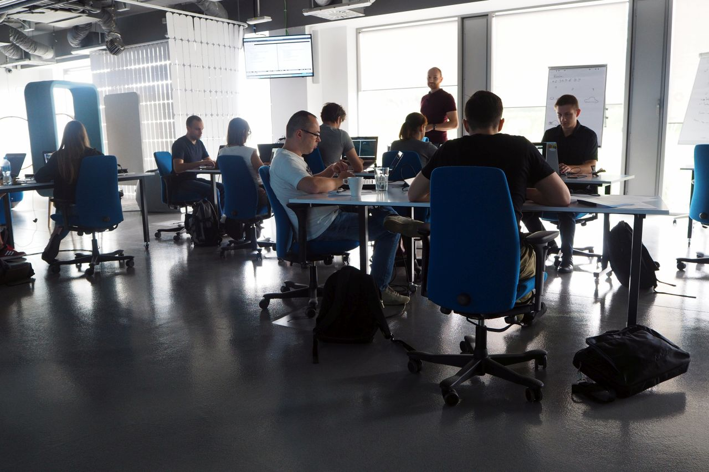

Z początkiem lipca w Coders School wystartowała kolejna edycja Kursu C++ dedykowanego dla osób, które chcą zostać młodszymi programistami C++. O samym kursie pisaliśmy już wcześniej np. [tutaj][1].

<!--more-->

## Zakres kursu C++

Kurs obejmuje zagadnienia związane z ogólnie pojętą inżynierią oprogramowania. Są to zasady uniwersalne dla każdego języka programowania, takie jak:

* użycie odpowiednich narzędzi (git, vim, make cmake),
* pisanie czystego kodu,
* standardy formatowania,
* obiektowość
* używanie wyjątków,
* wzorce projektowe,
* testowanie,
* złożoność obliczeniowa,
* Scrum.

Uczymy się na przykładzie języka C++, a więc zgłębiamy także rzeczy specyficzne dla tego języka, przede wszystkim:

* bibliotekę standardową STL,
* zarządzanie zasobami,
* nowoczesny C++ (C++11, C++14, C++17).

Zakończeniem kursu jest przygotowanie uczestników do rozmów rekrutacyjnych poprzez omówienie, czego mają się spodziewać i jak się dobrze przygotować do takich rozmów.

## Dwie grupy

Ta edycja kursu C++ obejmuje aż 2 grupy – wieczorową oraz weekendową. Spotykamy się odpowiednio w środy w godzinach 16:30-20:00 lub co drugą niedziele w godzinach 10:00-15:00. Każde z zajęć mają odmienną formę. Na niektórych z nich robimy programowanie w parach, na innych programowanie w większych grupach, na jeszcze innych tzw. Coding Dojo. Robimy też spotkania Scrumowe takie jak daily, retrospektywy czy review. Słowem - wszystko czego absolwenci uczelni lub osoby uczące się samodzielnie nie wiedzą jeszcze o pracy programisty, a na pewno będzie im to potrzebne w przyszłej pracy.

## Nokia Garage

Jedne z pierwszych lekcji tej edycji odbyły się w [Nokia Garage][2]. Jest to miejsce, które sprzyja kreatywnej pracy i zostało zaprojektowane w szczególny sposób. Do wpisu wrzuciłem kilka zdjęć z Nokia Garage. Było tam kilka ciekawostek technologicznych, z których najbardziej użyteczną dla nas była możliwość bezprzewodowego wyświetlania obrazu na kilku telewizorach i projektorach jednocześnie. Bardzo ciekawe były tez smart-tablice, które wyglądały jak zwykłe flipcharty, ale po zeskanowaniu widniejącego na nich kodu QR, uczestnicy mogli na ekranach smartfonów śledzić to co jest obecnie pisane na tablicy. Plusem tego miejsca była jego wszechstronność – każdy mógł pracować w dowolnej pozycji – stojącej przy wysokim stole, albo nawet leżącej na niskich pufach.

Nokia Garage jest miejscem, które wspiera rozwój rozwiązań z zakresu: IoT, 5G, Machine Learning, Artificial Intelligence, VR i AR. Jeśli masz pomysł, który chcesz rozwijać i jest związany z powyższymi technologiami, to możesz skontaktować się z [Garage Band’em][3]. I uwaga: wcale nie musisz być pracownikiem Nokii.

 [1]: /post/kurs-programowania-cpp/
 [2]: http://nokiagarage.pl/
 [3]: http://nokiagarage.pl/join-us/
