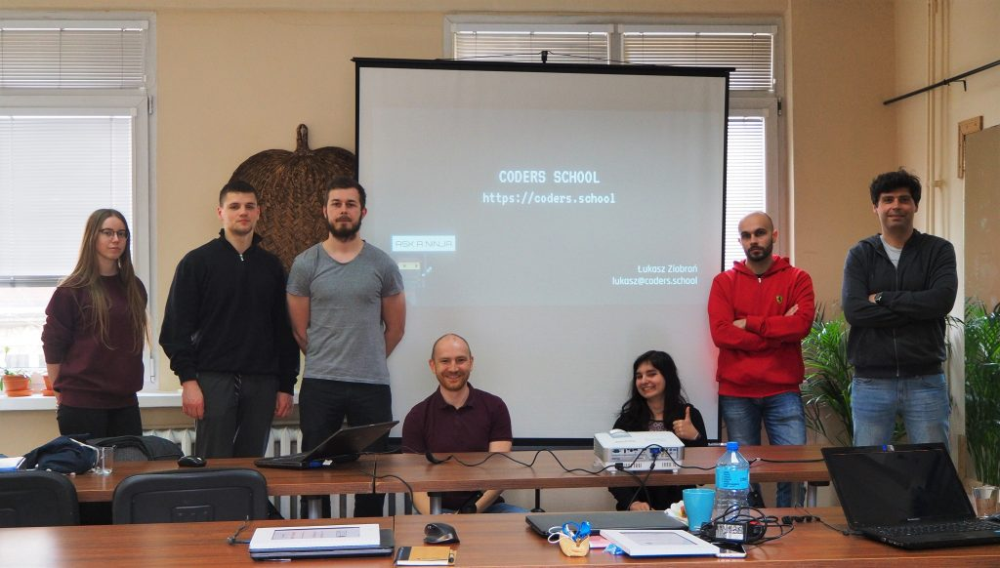
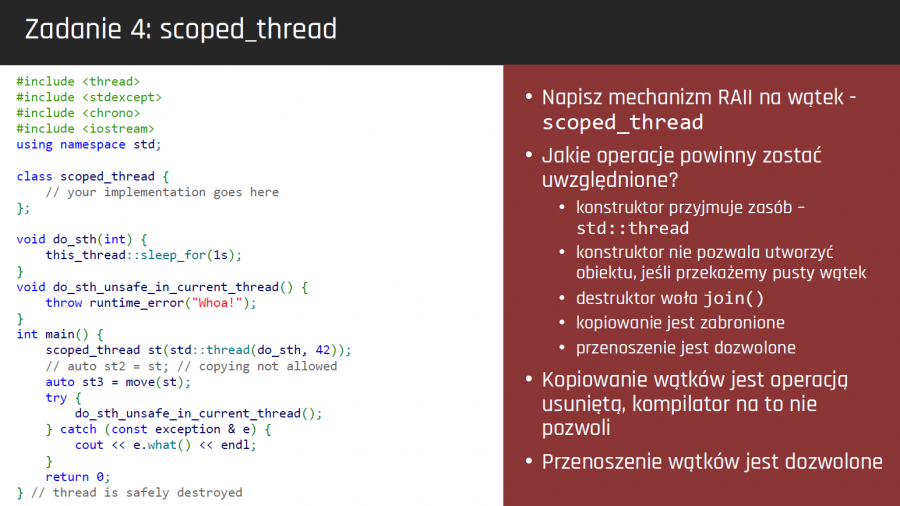

Jesteśmy już po pierwszej edycji kursu Wielowątkowość w C++. Był to zupełnie nowy kurs, przygotowany od zera w głównej mierze przeze mnie, ale nie tylko.

<!--more-->

W premierowej edycji mini kursu z [Wielowątkowości w C++][1] wzięło udział 12 osób. Większość z nich stanowili już dotychczasowi kursanci, który ukończyli [Kurs C++][2] lub mini kurs z STLa i postanowili jeszcze bardziej rozwinąć swoje umiejętności.

W ciągu [4 spotkań][3] omówiliśmy i przećwiczyliśmy mnóstwo zagadnień. Pokryliśmy praktycznie całą część biblioteki standardowej związanej z wielowątkowością w standardzie C++17. 

## Tematyka mini kursu Wielowątkowość w C++

* Teoria wielowątkowości`
* Wątki (std::thread)`
* Współdzielenie danych (std::mutex, std::lock\_guard, std::unique\_lock, std::shared\_lock,std::scoped\_lock, std::lock)`
* Zmienne warunku (std::condition_variable)`
* Zmienne atomowe i model pamięci (std::atomic)`
* Jednokrotne wywołania (std::call\_once, std::once\_flag)`
* Komunikacja jednokierunkowa (std::promise, std::future)`
* Funkcje asynchroniczne (std::async, std::packaged_task)`
* Problemy współbieżności (zakleszczenia, zagłodzenia, problem producenta i konsumenta, problemczytelników i pisarzy, problem ucztujących filozofów)`
* Testowanie aplikacji współbieżnych`
* Współbieżne wzorce projektowe (thread pool, active object, proactor, monitor, barrier, scheduler, #8230;)`

Standardowo dużo pracy miało miejsce poza spotkaniami. Do zaimplementowania były różne wielowątkowe aplikacje, które miały obrazować problemy na jakie standardowo można się natknąć podczas pisania takich aplikacji.

## Dodatkowy trener

Jakiś czas temu zgłosił się do mnie Ihor, który chciał dołączyć do Coders School jako trener. Przeprowadził on lekcję o std::promise i std::future, która została bardzo dobrze odebrana przez uczestników. Ponadto Ihor przeglądał rozwiązania kursantów i sugerował im poprawki oraz czuwał nad jakością moich materiałów szkoleniowych i zgłaszał nieścisłości lub błędy, które udało mu się wychwycić, za co bardzo mu dziękuję 🙂 Zapewne będziemy wspólnie prowadzić [4 edycję Kursu C++][2], która odbędzie się w te wakacje.

## Kolejna edycja dopiero za rok

Kurs zakończył się 5 maja. Kursanci otrzymali certyfikaty ukończenia kursu. Kolejna edycja mini kursu Wielowątkowość w C++ planowana jest dopiero w 2020 roku. Kurs zostanie też uzupełniony o nowości, które pojawią się w bibliotece standardowej C++20.

Wszystkim uczestnikom mini kursu Wielowątkowość w C++ bardzo serdecznie dziękuję za wspólnie spędzony czas. Mam nadzieję, że zdobyta wiedza i umiejętności zostaną przez was dobrze spożytkowane 🙂

 [1]: https://coders.school/mini-kursy-cpp/#wielowatkowosc
 [2]: https://coders.school/kurs-cpp/
 [3]: https://www.meetup.com/pl-PL/Kurs-programowania-C/events/vxxntqyzfbfc/