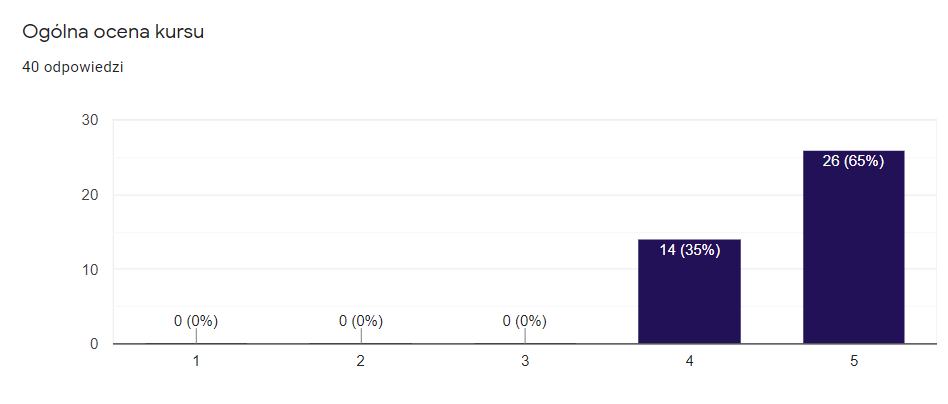

Na początku października zakończyła się czwarta edycja kursu C++ w Coders School. Uczestniczyły w niej osoby, które mają teraz niesamowicie mocną wiedzę techniczną potwierdzoną przez realizowane wspólnie projekty, zadania domowe i testy.

<!--more-->

Absolwenci zyskali nie tylko wiedzę, ale przede wszystkim praktyczne umiejętności z zakresu inżynierii oprogramowania, które są uniwersalne dla każdego języka obiektowego. Zyskali też coś poza umiejętnościami technicznymi &#8211; ciekawe znajomości. W związku z tym utworzył nam się zintegrowany zespół programistów, którzy znają się, wspólnie kodują, a wieczorami chodzą razem na pizzę i piwo 🙂 W sam raz na outsourcing do jakiegoś projektu 😉

Wśród absolwentów są osoby, które są już programistami. Są też osoby, które już nie są junior developerami 🙂

## 4 edycja w liczbach

* 2 grupy
* 34 zgłoszenia na kurs
* 19 certyfikowanych absolwentów
* 66 godzin zajęć w każdej grupie
* 2 lekcje online
* 132 nagrania z zajęć na YouTube
* 19 nagród książkowych [Zawód: Programista][1]
* 8 nagród książkowych [C++17 STL. Receptury][2]
* 24 nagrody &#8211; zaślepki na kamerkę

## Zmiany w 4 edycji kursu C++

* **Nagrania wideo z zajęć na YouTube**. Poprzednia edycja również była nagrywana, ale był to jedynie braz z laptopa + głos trenera. W tej edycji trener również był nagrywany na wideo 🙂 Dzięki nagranim ieobecność na zajęciach nie była niedogodnością. 
* **System punktowy z nagrodami**. Kursanci gromadzili punkty za różne aktywności: zadania domowe, rojekty, zadania algorytmiczne w serwisie Firecode.io, przeglądy kodu, aktywność na Discordzie, testy, pracowywanie materiałów, estymowanie zadań. Każda aktywność była opcjonalna i każdy sam wybierał obie, w jaki sposób uzyska punkty potrzebne do zaliczenia kursu. Za przekraczanie kolejnych progów unktowych rozdawaliśmy nagrody 🙂 
* **Dodatkowe lekcje z STL i testowania**. W tej edycji temat STLa został trochę bardziej rozszerzony oprzez dodatkowe lekcje online. Temat testowania również został dodatkowo przerobiony na zajęciach w ormie Coding Dojo. 
* **Lekcje online**. Ta edycja zawierała także spotkania online, które były transmitowane na żywo na ouTube. Została na nich rozszerzona tematyka biblioteki standardowej STL. 
* **Dwóch trenerów**. Nie byłem już jedynym trenerem na tym kursie. Swoją wiedzą dzielił się także hor, dzięki czemu kursanci mieli możliwość poznania różnych perspektyw na niektóre tematy. 

Przy zakończeniu trzeciej edycji kursu C++ opisywałem, jakie będą plany na czwartą edycję. Ten opis możecie znaleźć [tutaj][3]. Jedyną rzeczą, której nie udało się do końca zrealizować było otworzenie dodatkowej grupy od podstaw. Z mojej strony nie było czasu na prowadzenie dodatkowej grupy i przygotowywanie nowych materiałów.

## Wrażenia kursantów

Bardzo mnie cieszy, że nigdy jeszcze nie było żadnej negatywnej opinii o kursie. Pojawiają się oczywiście ciągle propozycje usprawnień, za które jestem niesamowcie wdzięczny, bo to one pozwalają rozwijać kurs tak, aby był jeszcze lepszy. Kurs w obecnej formie jest już jednak dość dobrze dopracowany. Gdybym miał się podzielić informacjami zwrotnymi, które dostałem od kursantów to potrzebaby było na nie bardzo dużo miejsca. Zamieszczę jednak zrzut ekranu z jednego pytania ankietowego na temat ogólnej oceny kursu. 3 oznacza, że kurs był zgodny z oczekiwaniami. Ocena 5 oznacza, że kurs znacznie przewyższył oczekiwania kursantów. 40 osób które odpowiedziało na to pytanie to uczestnicy wszystkich edycji tego kursu, nie tylko obecnej.

## Kolejna edycja?

Część osób pytała o kurs C++ już po zamknięciu zapisów. Wcześniej pisałem, że będzie to ostatnia edycja kursu C++. Na chwilę obecną nie jest zaplanowana kolejna edycja, pomimo coraz większego sukcesu tego kursu.

Teraz będę skupiał sie na stworzeniu kursu C++ online, a prawdopodobnie pod koniec przyszłego roku otworzę także zapisy na stacjonarną edycję kursu C++ we Wrocławiu, ale w trochę innej odsłonie. Stay tuned 😉

Zachęcam do śledzenia strony [Coders School na Facebooku][4].
  
Jeśli nie chcesz, aby informacja o zapisach Ci umknęła, polecam zostawić e-mail w [newsletterze][5].

 [1]: https://zawodprogramista.pl/
 [2]: https://helion.pl/ksiazki/c-17-stl-receptury-jacek-galowicz,cpp17r.htm
 [3]: /post/3-edycja-kursu-cpp-zakonczona/
 [4]: https://www.facebook.com/szkola.coders.school/
 [5]: /#newsletter
