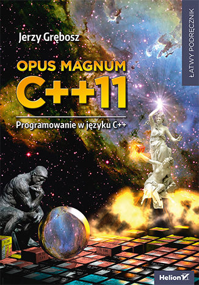
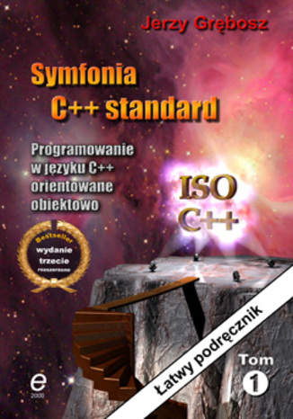
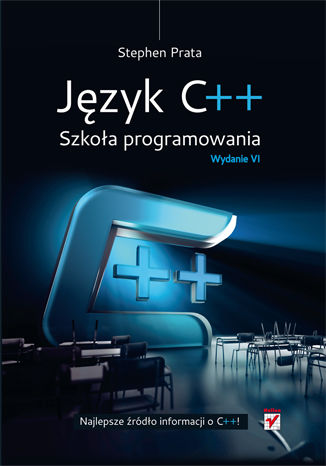
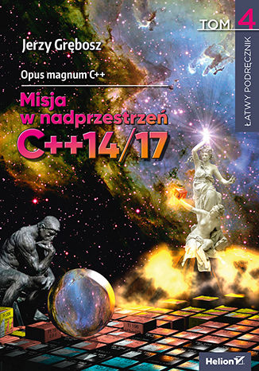
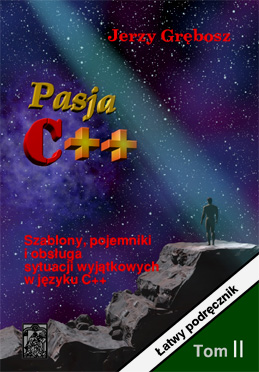
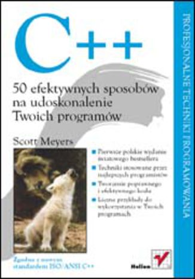
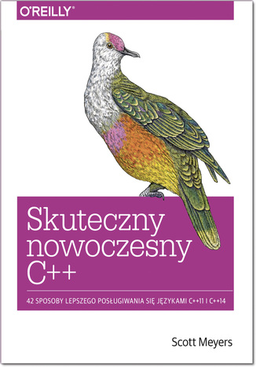

+++
title = "Materiały do nauki C++"
date = "2020-02-25T14:34:14+01:00"
draft = false
description = "Materiały do nauki C++, książki o c++, kursy online c++, pdf c++. Różne poziomy: dla początkujących, dla zaawansowanych, dla ekspertów."
keywords = ["książki c++", "książka c++", "ksiażki o c++ dla początkujących", "książki o c++ dla zaawansowanych", "książki o c++ pdf", "ksiażka o c++ dla początkujących", "książka o c++ dla zaawansowanych", "książka o c++", "c++ książki", "c++ książka", "jakie książki do c++", "jakie książki polecacie do c++", "z czego uczyć się c++", "książka do nauki c++", "książki do nauki c++", "książki programowanie c++", "książka programowanie c++", "c++ polecane książki"]
toc = true
autoCollapseToc = false
comment = true
show_in_homepage = true
description_as_summary = true
aliases = ["/resources/", "/ksiazki/", "/materialy/", "/hugo/resources/"]
+++

## Darmowe PDFy

| Książka | Opis |
| :-----: | :--- |
| [][goalkicker] | *goalkicker.com* praca zbiorowa wielu autorów [C++ Notes for Professionals][goalkicker]  <ul><li>ponad 700 stron</li><li>👍 standard C++17</li><li>przekrój całego języka C++</li><li>kompilowanie, debugowanie, profilowanie</li><li>narzędzia: CMake, make, ninja, nmake</li><li>OpenMP, Google Test, Catch</li><li>🇬🇧 pozycja w języku angielskim</li><li>:old_man: polecana dla zaawansowanych</li></ul> zobacz również inne języki programowania na [books.goalkicker.com](https://books.goalkicker.com) |

[goalkicker]: https://books.goalkicker.com/CPlusPlusBook/

## Książki o C++

Z książkami do jest tak samo jak z książkami do języków obcych, a nawet gorzej. Samo przeczytanie książki nie spowoduje, że będziesz znać język. Trzeba go przede wszystkim używać w praktyce. W podręcznikach do języków obcych zawsze są ćwiczenia, dzięki którym użyjesz nowych wyrazów lub konstrukcji. Podręczników do programowania raczej nie ma. Dlatego bardzo ważne jest, aby ucząc się tylko z książek od razu mieć przy sobie komputer i próbować zastosować pozyskaną wiedzę. Dla osób początkujących znacznie lepsze będzie kupienie taniego kursu online, np. na Udemy za 50 zł. Jeśli masz już jakieś doświadczenie, to książki mogą Ci dużo dać, o ile tylko faktycznie zastosujesz uzyskaną wiedzę.

Jeśli dobrze znasz angielski to w przypadku niektórych książek lepiej wybrać wersję angielską. Polskie przekłady czasem utrudniają czytanie. Angielskie książki są jednak droższe od polskich wersji.

### Dla początkujących

| Książka&nbsp;&nbsp;&nbsp;&nbsp;&nbsp;&nbsp;&nbsp;&nbsp;&nbsp;&nbsp;&nbsp;&nbsp;&nbsp;&nbsp;&nbsp;&nbsp;&nbsp;&nbsp;&nbsp;&nbsp;&nbsp;&nbsp;&nbsp;&nbsp; | Opis |
| :-----: | :--- |
| [][opus_magnum] | *Jerzy Grębosz* [Opus Magnum C++11. Programowanie w języku C++][opus_magnum]   <ul><li>3 tomy, 1600 stron</li><li>standard C++11</li><li>programowanie obiektowe</li><li>cały przekrój języka od podstawowych konstrukcji po szablony</li><li>podstawy biblioteki STL - strumienie, `vector`, `string`</li><li>:baby: dla początkujących</li><li>🇵🇱 książka polskiego autora</li><li>👍 polecam</li></ul> |
| [][symfonia] | *Jerzy Grębosz* [Symfonia C++ Standard. Programowanie w języku C++ orientowane obiektowo. Tom I i II][symfonia]  <ul><li>2 tomy, 1100 stron</li><li>standard C++03</li><li>programowanie obiektowe</li><li>:baby: dla początkujących</li><li>🇵🇱 książka polskiego autora</li><li>👎 odradzam ze względu na przestarzały standard</li></ul> |
| [][prata_pl] | *Stephan Prata* [🇵🇱 Język C++, szkoła programowania.][prata_pl] [🇬🇧 C++ Primer Plus][prata_eng]  <ul><li>1200 stron</li><li>standard C++11</li><li>programowanie obiektowe</li><li>biblioteka STL</li><li>przekrój całego języka C++</li><li>🇵🇱🇬🇧 pozycja dostępna w języku polskim i angielskim</li><li>:baby: dla początkujących</li><li>👎 nie polecam na start</li></ul> Wiele osób uczy się z tej książki C++, ale do końca jej nie polecam na start ze względu na niekonsekwencję w stosowaniu wcześniej wprowadzonych elementów. Dużo tych elementów później się zapomina, gdy nie są używane. |
| [][primer] | *Stanley B. Lippman, Josée Lajoie* [C++ Primer (5th Edition)][primer]  <ul><li>900 stron</li><li>standard C++11</li><li>programowanie obiektowe</li><li>biblioteka STL</li><li>🇬🇧 pozycja dostępna w języku angielskim</li><li>:baby: dla początkujących</li><li>👍 polecam</li></ul> Książka ta jest lepsza dla początkujących od książki *C++ Primer Plus*, której polska wersja to *Język C++, szkoła programowania* pana Praty (powyżej). Ma trochę bardziej przemawiający styl, ale nie ma aktualnego wydania w języku polskim. |
| [][stroustrup_programming_pl] | *Bjarne Stroustrup* [🇬🇧 Programming. Principles and Practice Using C++][stroustrup_programming_eng] [🇵🇱 Programowanie. Teoria i praktyka z wykorzystaniem C++][stroustrup_programming_pl]  <ul><li>1100 stron</li><li>standard C++14</li><li>programowanie obiektowe</li><li>biblioteka STL</li><li>tworzenie GUI</li><li>🇵🇱🇬🇧 pozycja dostępna w języku polskim i angielskim</li><li>:baby: :man: dla początkujących oraz średnio-zaawansowanych</li><li>👍 polecam</li></ul> Bjarne Stroustrup to twórca języka C++. Niektórzy polecają przeczytać ją dopiero po Opus Magnum, ale nie jest to konieczne. Prowadzi ona trochę dalej w głąb języka C++ niż Opus Magnum, więc osoby średnio-zaawansowane również znajdą coś dla siebie.  <blockquote cite="Alicja"> Ja zaczynałam od książki *Bjarne Stroustrup* "Programming: Principles and Practice C++" i bardzo ją sobie chwalę. Jest bardzo rzeczowa bez zbędnych informacji. Dobrze jest mieć ją w wersji papierowej, bo jest tak napisana, że tekst i kod są na dwóch sąsiadujących stronach, nie trzeba wertować. Symfonia Grębosza była dla mnie trochę męcząca. Jest w niej dużo dygresji, które miały na celu wyjaśnić pewne zagadnienia, ale niestety tylko bardziej mnie rozpraszały. Stroustrup jest dla tych co lubią krótko i na temat 😉 no może nie tak krotko, bo jest grubaśna.</blockquote> |

[opus_magnum]: https://helion.pl/ksiazki/opus-magnum-c-11-programowanie-w-jezyku-c-komplet-jerzy-grebosz,ocpp11.htm
[opus_magnum17]: https://helion.pl/ksiazki/opus-magnum-c-misja-w-nadprzestrzen-c-14-17-tom-4-jerzy-grebosz,opc144.htm
[symfonia]: https://helion.pl/ksiazki/symfonia-c-standard-programowanie-w-jezyku-c-orientowane-obiektowo-tom-i-i-ii-jerzy-grebosz,a_006w.htm
[prata_pl]: https://helion.pl/ksiazki/jezyk-c-szkola-programowania-wydanie-vi-stephen-prata,cppri6.htm
[prata_eng]: https://www.amazon.com/Primer-Plus-6th-Developers-Library/dp/0321776402
[primer]: https://www.amazon.com/Primer-5th-Stanley-B-Lippman/dp/0321714113/
[stroustrup_programming_pl]: https://helion.pl/ksiazki/programowanie-teoria-i-praktyka-z-wykorzystaniem-c-bjarne-stroustrup,pcpptp.htm
[stroustrup_programming_eng]: http://www.stroustrup.com/programming.html

### Dla średnio-zaawansowanych

Tabela w trakcie opracowania

| Książka&nbsp;&nbsp;&nbsp;&nbsp;&nbsp;&nbsp;&nbsp;&nbsp;&nbsp;&nbsp;&nbsp;&nbsp;&nbsp;&nbsp;&nbsp;&nbsp;&nbsp;&nbsp;&nbsp;&nbsp;&nbsp;&nbsp;&nbsp;&nbsp; | Opis |
| :-----: | :--- |
| [][opus_magnum17] | *Jerzy Grębosz* [Opus magnum C++. Misja w nadprzestrzeń C++14/17. Tom 4][opus_magnum17]  <ul><li>280 stron</li><li>kontynuacja Opus Magnum C++11</li><li>dla osób znających C++11</li><li>standard C++14 i C++17</li><li>:man: dla średnio-zaawansowanych</li><li>🇵🇱 książka polskiego autora</li></ul> Jeszcze nie mogę polecić lub odradzić, bo książka jeszcze nie jest dostępna w sprzedaży (piszę to w lutym 2020). |
|  | *Jerzy Grębosz* Pasja C++  <ul><li>2 tomy, 600 stron</li><li>kontynuacja Symfonii C++</li><li>szablony, kontenery STL, wyjątki</li><li>standard C++03</li><li>:man: dla średnio-zaawansowanych</li><li>🇵🇱 książka polskiego autora</li><li>👎 odradzam ze względu na przestarzały standard</li></ul> |
| [][effective_cpp_pl] | *Scott Meyers* Effective C++  🇵🇱🇬🇧👍 |
| | *Scott Meyers* More Effective C++  🇵🇱🇬🇧👍 |
| | *Scott Meyers* Effective STL  🇵🇱🇬🇧👍 |
| [][effective_modern_cpp_pl] | *Scott Meyers* [🇵🇱 Skuteczny nowoczesny C++. 42 sposoby lepszego posługiwania się językami C++11 i C++14][effective_modern_cpp_pl] [🇬🇧 Effective Modern C++. 42 Specific Ways to Improve Your Use of C++11 and C++14][effective_modern_cpp_eng]  <ul><li>🇵🇱 390 stron / 🇬🇧 330 stron</li><li>standard C++14</li><li>dedukcja typów i auto</li><li>smart pointery</li><li>semantyka przenoszenia</li><li>lambdy</li><li>współbieżność</li><li>🇵🇱🇬🇧 pozycja dostępna w języku polskim i angielskim</li><li>:man: dla średnio-zaawansowanych</li><li>👍 bardzo polecam</li></ul> Scott Meyers ma bardzo łatwy w odbiorze styl pisania. Polecamy wszystkie jego książki. Rozdziały są dość krótkie, zazwyczaj do 10 stron i zagłębiają się maksymalnie w dane zagadnienie. Polskie wersje są dobrze przetumaczone. |
| | *Jacek Galowicz* [🇬🇧 C++17 STL Cookbook](https://helion.pl/ksiazki/c-17-stl-cookbook-jacek-galowicz,e_15l9.htm) [🇵🇱 C++17 STL. Receptury](https://helion.pl/ksiazki/c-17-stl-receptury-jacek-galowicz,cpp17r.htm) |
| | *Bjarne Stroustrup* [🇬🇧 A Tour of C++](http://www.stroustrup.com/tour2.html) [🇵🇱 Projektowanie i rozwój języka C+](https://helion.pl/ksiazki/c-podroz-po-jezyku-dla-zaawansowanych-wydanie-ii-bjarne-stroustrup,cppoz2.htm), 2018 |
| | *Andrei Alexandrescu, Herb Sutter* [🇬🇧 C++ Coding Standards](http://erdani.com/index.php/books/ccs/) [🇵🇱 Język C++. Standardy kodowania](https://helion.pl/ksiazki/jezyk-c-standardy-kodowania-101-zasad-wytycznych-i-zalecanych-praktyk-herb-sutter-andrei-alexandrescu,cpskod.htm) |
| | *Herb Sutter* Exceptional C++ |
| | *Herb Sutter* More Exceptional C++  |
| | H*erb Sutter* Exceptional C++ Style |
| | *Stanley B. Lippman* Inside the C++ Object Model |

[effective_cpp_eng]: #
[effective_cpp_pl]: #
[effective_modern_cpp_pl]: https://helion.pl/ksiazki/skuteczny-nowoczesny-c-42-sposoby-lepszego-poslugiwania-sie-jezykami-c-11-i-c-14-scott-meyers,e_07we.htm
[effective_modern_cpp_eng]: https://helion.pl/ksiazki/effective-modern-c-42-specific-ways-to-improve-your-use-of-c-11-and-c-14-scott-meyers,e_2gt8.htm

### Dla zaawansowanych

Tabela w trakcie opracowania

| Książka | Opis |
| :-----: | :--- |
| | Anthony Williams, [🇬🇧 C++ Concurrency in Action](https://www.manning.com/books/c-plus-plus-concurrency-in-action-second-edition), [🇵🇱 Język C++ i przetwarzanie współbieżne w akcji](https://helion.pl/ksiazki/jezyk-c-i-przetwarzanie-wspolbiezne-w-akcji-anthony-williams,jcpppw.htm), 2019. Książka o wielowątkowości w języki C++ w najnowszym obecnie standardzie C++17 (wydanie 2) |
| | Bjarne Stroustrup, [🇬🇧 The C++ Programming Language (4th Edition)](http://www.stroustrup.com/4th.html), [🇵🇱 Język C++. Kompendium wiedzy, Wydanie IV](https://helion.pl/ksiazki/jezyk-c-kompendium-wiedzy-wydanie-iv-bjarne-stroustrup,jcppkw.htm), 2013 |
| | Andrei Alexandrescu, [🇬🇧 Modern C++ Design](http://erdani.com/index.php/books/modern-c-design/), [🇵🇱 Nowoczesne projektowanie w C++](https://helion.pl/ksiazki/nowoczesne-projektowanie-w-c-uogolnione-implementacje-wzorcow-projektowych-andrei-alexandrescu,nowopc.htm). Książka dla twardzieli. Nie polecam do snu, bo zaśniesz zanim przeczytasz 1 stronę. Bardzo cenna ekspercka wiedza, ale jej trawienie wymaga ogromnego skupienia. |
| | David Vandevoorde , Nicolai M. Josuttis , Douglas Gregor, C++ Templates: The Complete Guide Sep 14, 2017 |

## Książki o programowaniu ogólnie

1. :baby: Maciej Aniserowicz, Zawód: programista
2. :man: Maciej Aniserowicz, Programista. i co dalej?
3. :man: Andrew Hunt, Pragmatyczny programista
4. :man: Gynvael Coldwind, Zrozumieć programowanie
5. :man: Robert C. Martin, Clean Code
6. :man: Michael Feathers, Working Effectively With Legacy Code. Tylko proszę, nie kupuj jej po polsku. No chyba, że lubisz określenia jarzmo testowe i spoina testowa.

## Kursy online

### Po polsku

1. Mirosław Zelent - [Kurs C++](https://miroslawzelent.pl/kurs-c++/)
2. Mirosław Zelent - [Kurs Obiektowy C++](https://miroslawzelent.pl/kurs-obiektowy-c++/)
3. Tomasz Jaśniewski - [KURS C++ od podstaw. Szkoła średnia, studia](https://www.youtube.com/watch?v=Z_DPVKlk2nA&list=PLKmH7u1gA9hpkNGJJFA5fB8MfPXWDQ1Fy)

### Po angielsku

1. [Bo Qian](https://www.youtube.com/channel/UCEOGtxYTB6vo6MQ-WQ9W_nQ)

## Repozytoria

## Inne linki

1. [Programowanie w języku C++](https://infotraining.bitbucket.io/cpp-bs)
2. [Nowoczesny C++](https://infotraining.bitbucket.io/cpp-modern)
3. [Programowanie w C++11](https://infotraining.bitbucket.io/cpp-11)
4. [Efektywne wykorzystanie biblioteki standardowej C++](https://infotraining.bitbucket.io/cpp-stl)
5. [Programowanie w C++17](https://infotraining.bitbucket.io/cpp-17)
6. [Zaawansowane programowanie w języku C++](https://infotraining.bitbucket.io/cpp-adv)
7. [Test-Driven-Development w języku C++](https://infotraining.bitbucket.io/cpp-tdd)
8. [Wzorce projektowe w języku C++](https://infotraining.bitbucket.io/cpp-dp)
9. [Programowanie generyczne w języku C++](https://infotraining.bitbucket.io/cpp-templates)
10. [Programowanie wielowątkowe w C++](https://infotraining.bitbucket.io/cpp-thd)

---

Chcesz dorzucić jakąś pozycję? [Zrób Pull Request](https://github.com/coders-school/site/tree/master/content/resources)

Podziękowania dla [dotychczasowych kontrybutorów](https://github.com/coders-school/site/graphs/contributors)
